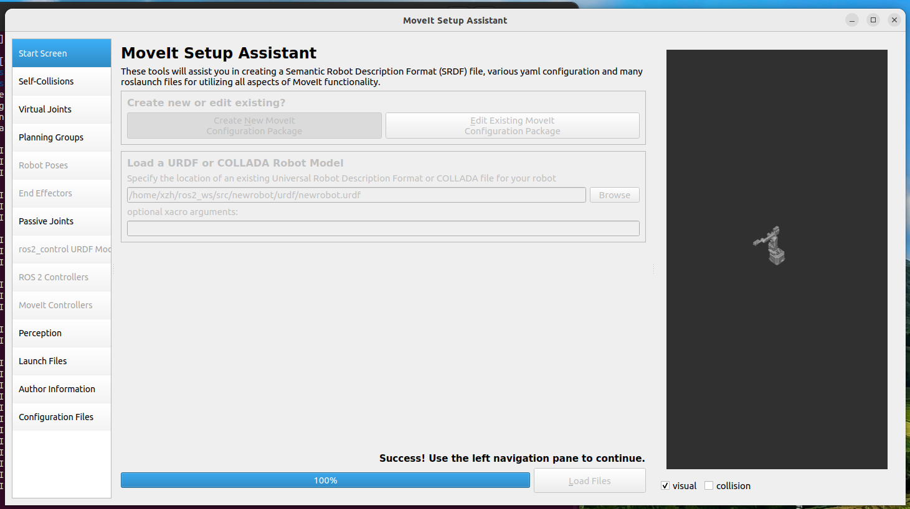
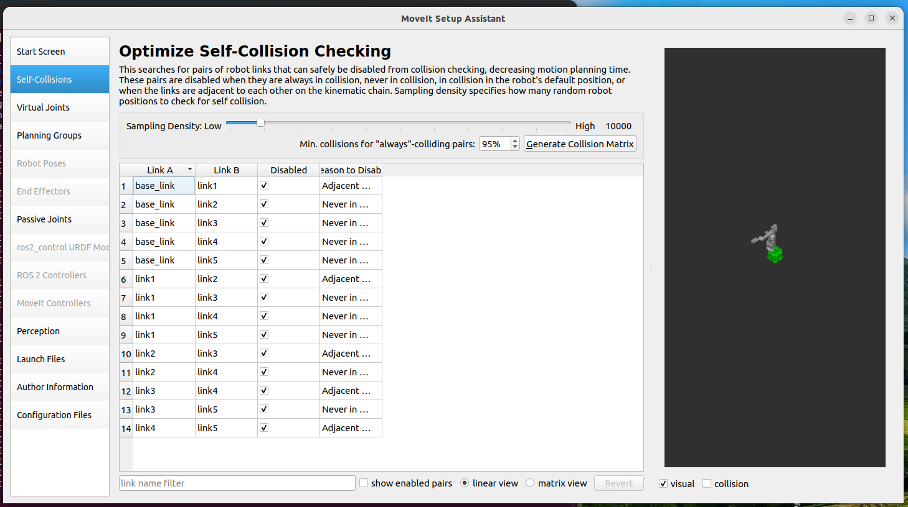
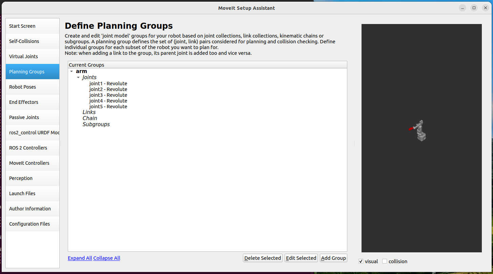
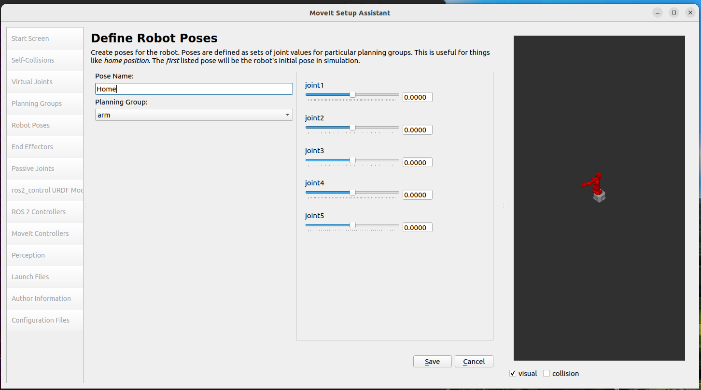
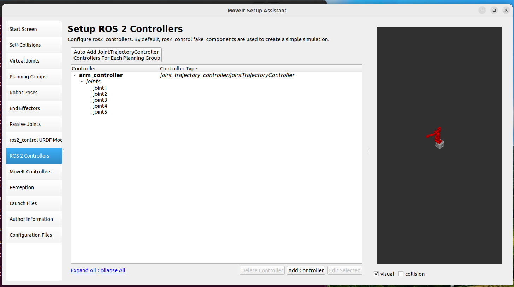
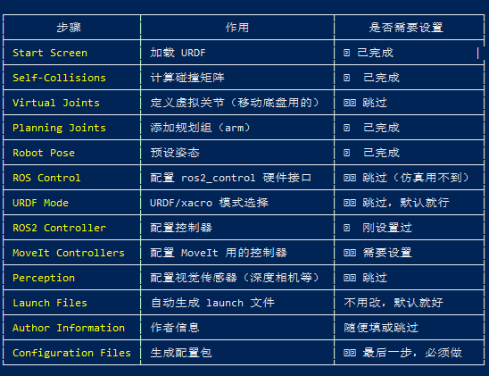

# 项目操作记录

> 记录每次对项目的改动，方便回溯和交接。

---

## 使用说明

每条记录按以下模板填写：

```
### YYYY/MM/DD  操作人

**类型**：[文档/代码/硬件/其他]

**内容**：做了什么

**原因**：为什么做（可选）

**相关文件**：改动了哪些文件（可选）
```

---

## 模板

### YYYY/MM/DD  姓名

**类型**：

**内容**：

**原因**：

**相关文件**：

---

## 记录

### 2026/05/23  xuzhihao-248

**类型**：文档

**内容**：引入原版 Dummy 开源模型，使用 AI 整理学习路径

**原因**：方便查找相关资料和学习

**相关文件**：`raw/`、`raw/dummy/AI项目解读/`

> **重要约定**：所有原始文件放在 `raw/` 中，不要修改。自己的修改另存到根目录下新建文件夹（如 `selfModel/`），命名方式采用小驼峰命名法。如有版本对比必要，文件名加时间。

---

### 2026/05/23  xuzhihao-248

**类型**：文档

**内容**：整理 GitHub SSH 协作指南

**原因**：统一团队 Git 工作流，解决 Clash Verge 端口冲突问题

**相关文件**：`doc/GitHub协作指南.md`

---

### 2026/05/23  xuzhihao-248

**类型**：文档

**内容**：撰写需求文档 proposal.md，规划五期开发目标（复刻→原理→视觉→SLAM→VLA）

**原因**：为项目建立清晰的长期路线图

**相关文件**：`doc/proposal.md`

---

### 2026/05/23  xuzhihao-248

**类型**：文档

**内容**：撰写任务拆分 tasks.md，将五期目标拆为 62 个可执行任务

**原因**：需求文档落地为具体任务，方便追踪进度

**相关文件**：`doc/tasks.md`

---

### 2026/05/23  xuzhihao-248

**类型**：文档

**内容**：撰写一期复刻技术文档，采用"先电子后机械"策略

**原因**：零基础可执行的开发手册；确定用嘉立创做 PCB、减速器走便宜路线、先桌面调通电子再装机械

**相关文件**：`doc/一期复刻技术文档.md`

---

### 2026/05/23  xuzhihao-248

**类型**：环境

**内容**：配置 Git SSH 连接、解决 Clash Verge 端口冲突、改用 HTTPS + 代理

**原因**：确保 GitHub 仓库可正常拉取和推送

**相关文件**：`~/.ssh/config`（已删除）、Git 全局代理配置

### 2026/05/24  xuzhihao-248

**类型**：文件

**内容**：增加了固件和软件

**原因**：为了方便学习相关程序

**相关文件**：raw\dummy\zhihui原版\Dummy-Robot-main

---

### 2026/06/05  xuzhihao-248

**类型**：环境

**内容**：完成 Ubuntu 22.04 虚拟机环境搭建 + ROS2 Humble 安装 + 开发工具链配置

**环境**：VMware Workstation Pro + Ubuntu 22.04 LTS

**完成事项**：

1. **系统初始化**：更新系统、安装基础工具（curl/wget/git/vim/build-essential）、更换清华镜像源
2. **VMware Tools**：安装 open-vm-tools，实现鼠标自由进出、剪贴板共享、拖拽文件、自适应分辨率
3. **SSH Server**：安装 openssh-server，启用开机自启，VSCode Remote-SSH 连接虚拟机
4. **ROS2 Humble 安装**：设置 UTF-8 Locale → 添加 ROS2 软件源和 GPG 密钥 → 安装 ros-humble-desktop → 安装 colcon/rosdep/ros-dev-tools → 初始化 rosdep → 写入 ~/.bashrc
5. **工作空间**：创建 `~/ros2_ws/src/`，配置 `source ~/ros2_ws/install/setup.bash`
6. **Python uv**：安装 uv 包管理器，安装 Python 3.10（与 ROS2 Humble 绑定版本一致），配置虚拟环境工作流
7. **仿真工具**：安装 Gazebo（ros-humble-gazebo-ros-pkgs）、Navigation2（ros-humble-navigation2）、MoveIt2（ros-humble-moveit）
8. **共享文件夹**：配置 VMware 共享文件夹 `D:\code\project\roboticArm` → VM `/mnt/hgfs/`，实现 Windows↔VM 高速文件传输

**验证**：`ros2 run demo_nodes_cpp talker` + `ros2 run demo_nodes_py listener` 通信成功

**相关文件**：`~/ros2_ws/`、`~/.bashrc`、`/etc/fstab`

---

### 2026/06/05  xuzhihao-248

**类型**：代码

**内容**：SolidWorks 机械臂 URDF → ROS2 RViz2 全流程打通

**前提**：SolidWorks 侧使用 SW URDF Exporter 插件导出 6 轴机械臂（1 底座 + 5 关节，末端还没有考虑），每个关节处手动建参考坐标系使 Z 轴对齐旋转轴

**完成事项**：

1. **文件传输**：通过 VMware 共享文件夹将导出的 URDF 包从 Windows 拷贝到 `~/ros2_ws/src/`（避免用 SCP，NAT 网络下极慢）
2. **ROS1→ROS2 转换**：
   - `package.xml`：format 改为 3，catkin → ament_cmake，添加 rviz2/robot_state_publisher/joint_state_publisher_gui 依赖
   - `CMakeLists.txt`：替换为 5 行 ament_cmake 标准模板（用 printf 写入，避免 Windows 换行符问题）
   - `launch/display.launch.py`：新建 ROS2 Python launch，启动 robot_state_publisher + joint_state_publisher_gui + rviz2 三个节点
   - 删除 ROS1 遗留文件（display.launch、gazebo.launch、export.log）
3. **URDF 修复**：Joint3 角度上下限相同（1.047/1.047）导致关节锁死，改为 -1.047/1.047
4. **编译运行**：`colcon build --symlink-install` → `source install/setup.bash` → `ros2 launch my_robot display.launch.py`
5. **RViz2 配置**：Fixed Frame → base_link，添加 RobotModel，Description Topic → /robot_description

**踩过的坑**：
- `src/` 根目录下多余的 CMakeLists.txt 导致编译解析失败（heredoc 跨平台写入出错）
- RViz2 只看到 TF 坐标轴没有 3D 模型 → Description Topic 未设置为 /robot_description
- 机械臂水平躺倒 → base_link 参考坐标系 Z 轴未竖直向上，需在 SolidWorks 中手动修正
- 不要从 Windows 直接复制 CMakeLists.txt 到 VM，隐藏字符会导致 CMake 解析失败

**相关文件**：`~/ros2_ws/src/my_robot/`（后改名为 newrobot）、`D:\code\project\roboticArm\my\urdf\`   
**参考**：https://mp.weixin.qq.com/s?__biz=MzU1NjEwMTY0Mw==&mid=2247605924&idx=1&sn=5dc503fe141886e4feffadc92bc9ef39&chksm=fa7e9dd839d804376f49be638c164ae6c0909022df00a8904f21af94e19e2bf68c4ddf3e7eaf&scene=27

---

### 2026/06/06 20:29  xuzhihao-248

**类型**：环境

**内容**：MoveIt2 Setup Assistant 导入 URDF 时闪退，报错 `PackageNotFoundError`

**问题描述**：
启动 MoveIt Setup Assistant 后，加载 URDF 文件时立即闪退，终端报错：
```
terminate called after throwing an instance of 'ament_index_cpp::PackageNotFoundError'
  what():  package 'newrobot' not found
```

**尝试过的错误方案**：
1. 把 URDF 中的 `package://newrobot/meshes/` 替换为绝对路径 → 仍然闪退，原因相同
2. 用 `LIBGL_ALWAYS_SOFTWARE=1` 软件渲染启动 → 无效，非图形问题

**最终解决方案**：
MoveIt Setup Assistant 要求 URDF 必须以 **ROS2 功能包** 的形式存在，不能直接加载裸 URDF 文件。具体步骤：

1. 确保 URDF 文件位于一个完整的 ROS2 功能包中（含 `package.xml`、`CMakeLists.txt`、`urdf/`、`meshes/` 目录），且 URDF 内使用 `package://包名/meshes/` 路径
2. 在工作空间根目录执行 `colcon build --packages-select <包名>` 编译
3. 在**启动 Setup Assistant 的同一个终端**中先执行 `source install/setup.bash`
4. 再启动 `ros2 launch moveit_setup_assistant setup_assistant.launch.py`
5. 此时加载 URDF 文件即可正常识别，不会闪退

**相关文件**：`~/ros2_ws/src/newrobot/`、`~/moveit_robot/urdf/newrobot.urdf`（绝对路径版备用）

**方案来源**：CSDN 博主「热心市民R先生」
https://blog.csdn.net/h542812556sdu/article/details/148025046

---

### 2026/06/06 20:46  xuzhihao-248

**类型**：环境

**内容**：MoveIt demo.launch.py 启动时报错 `package 'controller_manager' not found`，RViz 中无机器人模型显示

**问题描述**：
MoveIt Setup Assistant 配置完成并编译后，执行 `ros2 launch newrobot_moveit_config demo.launch.py` 时：
1. RViz 打开但无任何内容，Fixed Frame 报 `No TF data`
2. 终端报错 `package 'controller_manager' not found`

**原因**：
MoveIt Setup Assistant 中配置了 ROS2 Controller（`ros2_control` 相关），但系统未安装 `ros2_control` 及其依赖包。

**解决方案**：
安装缺失的 ROS2 控制相关包：

```bash
sudo apt install ros-humble-ros2-control ros-humble-ros2-controllers ros-humble-joint-state-broadcaster ros-humble-joint-trajectory-controller ros-humble-controller-manager
```

安装后重新启动即可正常显示机器人模型并进行运动规划。

**相关文件**：`~/ros2_ws/src/newrobot_moveit_config/`

---

### 2026/06/06 21:00  xuzhihao-248

**类型**：环境

**内容**：完整配置 MoveIt2 Setup Assistant 并成功启动 demo.launch.py

**前提条件**：
- URDF 功能包已编译（`colcon build --packages-select newrobot`）
- 启动前已 `source install/setup.bash`
- 已安装 MoveIt2（`sudo apt install ros-humble-moveit`）

**Setup Assistant 配置步骤**：

1. **启动**：`ros2 launch moveit_setup_assistant setup_assistant.launch.py`
2. **Start Screen** → Load Files → 选择编译好的 URDF（必须 source 过）

   

3. **Self-Collisions** → Generate Collision Matrix（自动计算，6 个 link，15 组碰撞对）

   

4. **Planning Joints** → Add Group：
   - Group Name: `arm`
   - Kin. Solver: `KDLKinematicPlugin`
   - Add Joints → 逐个勾选 joint1 ~ joint5

   

5. **Robot Poses** → Add Pose → `home`，所有关节角度填 0

   

6. **ROS2 Control URDF Modifications** → 保持默认（command: position，state: position + velocity）
7. **ROS2 Controller** → Add Controller → `joint_trajectory_controller/JointTrajectoryController` → Add Planning Group Joints → 选 arm

   

8. **MoveIt Controllers** → Add Controller → `FollowJointTrajectory` → Add Planning Group Joints → 选 arm
9. **Configuration Files** → Generate Package → 保存到 `~/ros2_ws/src/newrobot_moveit_config`

   

   **成功后展示效果：**

   <video controls src="images/moveit_setup/07_demo_preview.mp4" title="成功后展示效果"></video>

**配置过程中遇到的问题**：

| 问题 | 原因 | 解决 |
|------|------|------|
| Planning Joints 标红，`Group 'arm' is empty` | Add Joints 时没有正确选中关节 | 重新 Add Group → Add Joints → 逐个勾选 joint1-5 → Save |
| Generate Package 时文件标红 | 之前有残留的配置文件 | 全部勾选覆盖即可 |
| `ros2 launch` 报 `Package not found` | 未编译新生成的配置包 | `colcon build --packages-select newrobot_moveit_config` |
| RViz 无模型，`No TF data` | 缺少 ros2_control 依赖包 | 安装 ros-humble-ros2-control 等（见上条记录） |

**编译与启动命令**：

```bash
cd ~/ros2_ws
colcon build --packages-select newrobot newrobot_moveit_config
source install/setup.bash
ros2 launch newrobot_moveit_config demo.launch.py
```

**最终效果**：RViz 中显示机器人模型，可通过 MotionPlanning 面板拖动末端并进行路径规划。

---

### 2026/06/06 21:15  xuzhihao-248

**类型**：文档

**内容**：MoveIt2 RViz 基本操作、Planning Options 参数说明、重影问题解决

**相关文件**：`~/ros2_ws/src/newrobot_moveit_config/`

#### MoveIt2 RViz 基本操作

| 操作 | 方法 |
|------|------|
| 拖动末端 | 鼠标左键拖动蓝色球（位置）或红绿蓝箭头（单轴） |
| 规划路径 | Planning 标签 → Plan（只看路径） |
| 规划并执行 | Planning 标签 → Plan & Execute（机器人动起来） |
| 随机姿态 | Planning 标签 → Random |
| 回零位 | Planning 标签 → Goal State → home |
| 添加障碍物 | Scene 标签 → Add Box / Sphere / Cylinder（规划时自动避障） |
| 单关节控制 | Joints 标签 → 拖动各 joint 滑块 |

#### Planning Options 参数说明

| 参数 | 含义 | 默认值 | 建议 |
|------|------|--------|------|
| Planning Time | 规划算法最大运行时间（秒） | 5 | 保持默认，复杂场景可调到 10 |
| Planning Attempts | 规划失败重试次数 | 10 | 保持默认 |
| Velocity Scaling | 速度缩放比例（0~1） | 0.1 | 刚上手用 0.1，熟悉后调到 0.5 |
| Acceleration Scaling | 加速度缩放比例（0~1） | 0.1 | 刚上手用 0.1，熟悉后调到 0.5 |

> Velocity / Acceleration Scaling = 0.1 表示最大速度/加速度的 10%，适合初学慢速观察。仿真中可调到 1.0 测试极限。

#### 问题：RViz 中机器人出现重影

**原因**：MotionPlanning 插件中多个显示层同时开启，导致多个机器人模型叠加显示。

**解决方案**：
在 Displays 面板中：
1. MotionPlanning → **Scene Robot** → 取消勾选 **Show Scene Robot** ❌
2. MotionPlanning → **Planned Path** → 取消勾选 **Show Robot Visual** ❌（或保持，仅规划时显示）
3. 只保留 **RobotModel** 勾选 ✅

#### 问题：Planning Time 设为 0 后卡死

**原因**：Planning Time 是规划算法的最大运行时间（秒）。设为 0 意味着给规划器 0 秒计算路径，无法完成规划。

**解决方案**：Planning Time 不能为 0，最小保持 1 秒，建议默认值 5。

---

#### 问题：move_group 进程崩溃（exit code -9），机器人无法运动

**现象**：终端报错 `process has died [pid xxx, exit code -9]`，RViz 中机器人无法再执行规划。

**原因**：exit code -9 表示进程被系统强制杀死（SIGKILL），通常是 VMware 虚拟机内存不足触发 OOM Killer。

**解决方案**：

```bash
# 杀掉所有残留进程
pkill -f moveit
pkill -f rviz

# 重新启动
source ~/ros2_ws/install/setup.bash
ros2 launch newrobot_moveit_config demo.launch.py
```

**预防措施**：
- 确保虚拟机分配足够内存（建议 8GB+）
- 关闭不必要的后台程序
- 如频繁出现，用 `free -h` 监控内存使用情况

---

### 2026/06/06 21:30  xuzhihao-248

**类型**：文档

**内容**：MoveIt 用途、主控板必要性、CAN 总线能力的知识点整理

#### Q1：MoveIt 有什么用？

MoveIt 是机器人的"大脑"，负责运动规划。核心流程：

```
目标位置 → 逆运动学求关节角度 → 轨迹规划（平滑路径） → 输出给电机
```

接入真实硬件后的架构：MoveIt 规划路径 → ros2_control 硬件接口 → 你的驱动节点 → CAN 总线 → STM32 驱动板 → 电机转动。

#### Q2：可以不要主控板，电脑直连驱动板吗？

可以。对比：

| 方案 | 优点 | 缺点 |
|------|------|------|
| 电脑直连 USB-CAN | 少一块板，调试方便，MoveIt 直接输出 | Linux 非实时，同步靠代码实现 |
| 用主控板（原版方案） | 实时性好，6 电机同步广播 | 多一块板（~100 元） |

建议：学习阶段电脑直连，以后需要独立运行时再加主控板。

#### Q3：CAN 总线能力

- 每个驱动板有唯一 CAN ID（1~6），可单独控制也可广播
- CAN 波特率：1 Mbps
- 实际控制频率：100~1000 Hz（取决于固件配置）
- MoveIt 输出频率：通常 100 Hz
- 数据量：5 电机 × 4 字节 = 20 字节/周期，远低于 CAN 带宽极限

---

### 2026/6/7  xuzhihao-248

**类型**：文档

**内容**：添加了三个新文档

**原因**：为了方便了解原版中的固件、软件和运行逻辑

**相关文件**：doc/固件解析.md 软件解析.md 电路板解析.md

---

### 2026/6/7  xuzhihao-248

**类型**：硬件

**内容**：安装 KiCad 8.0，从 Altium 工程文件导入 MotorDriver-42 原理图和 PCB，导出 BOM 表，MotorDriver-42 PCB 已下单嘉立创打样

**关键操作**：

1. **KiCad 导入**：文件 → 导入 → 非 KiCad 工程 → Altium Designer 工程 → 选择 `Motor-42.PrjPCB`，5 页原理图 + 4 层 PCB 导入成功
2. **BOM 导出**：工具 → 生成 BOM → 导出为 CSV（遇到 UTF-8 编码问题，Excel 打开乱码，已通过添加 BOM（UTF-8 with BOM）解决）
3. **BOM 核实（部分完成）**：
   - ✅ TB67H450FNG ×2（确认双芯片设计）
   - ✅ 晶振 12MHz（确认与固件 `hal_conf.h` 的 `HSE_VALUE 12000000U` 一致）
   - ✅ CAN 收发器 SN65HVD232DR
   - ✅ 电源方案 ME3116 + LP2992 + TL431 + TPS61040（非之前推测的 AMS1117）
   - ⬜ 连接器间距 SH1.0mm 待确认
   - ⬜ 全部封装名与实物对应关系待核对

4. **PCB 下单**：嘉立创，10 片，4 层 FR-4，1.6mm，绿色阻焊，有铅喷锡，72-96h 加急
5. **文档修正**：`doc/电路板解析.md` 修正晶振频率（8→12MHz）、CAN 收发器型号、电源方案，新增 §3.6 时钟配置来源说明

**下一步**：核实 BOM 表中连接器和其他器件参数，确认后下单元器件采购

**相关文件**：`my/HardWarePCB/MotorDriver/Motor-42.kicad_pro`、`my/HardWarePCB/MotorDriver/Motor-42.csv`（BOM）、`doc/电路板解析.md`

### 2026/6/8  xuzhihao-248

**类型**：

**内容**：通过solidworks测量了电机和减速器的尺寸   3*42步进电机 Φ5mm   3*20步进电机 Φ5mm
   减速器
      1*42mm*42mm*32mm Φ10
      2*30.7mm*30.7mm*26.9mm phi5mm phi9mm
      3*20mm*20mm*15.2mm  phi3mm  phi5mm

**原因**：

**相关文件**：

---

### 2026/06/15  xuzhihao-248

**类型**：代码 + 环境

**内容**：6 轴机械臂 URDF 导出 → ROS2 转换 → Unity 导入 → 6 关节仿真全流程踩坑记录

**原因**：从 5 轴升级到 6 轴，SolidWorks 导出和 Unity 导入过程中遇到大量问题，统一记录

**相关文件**：`D:\code\project\roboticArm\my\urdf\selfModel\`、`D:\code\project\roboticArmUnity\src\roboticArmStudio\`

#### 一、SolidWorks URDF 导出踩坑

| # | 问题 | 原因 | 解决 |
|---|------|------|------|
| 1 | STL 文件只有 84 字节（空壳） | 零件是**虚拟组件**，内嵌在装配体中，Exporter 无法正确导出 | 右键零件 → **设为外部**，保存为独立 .SLDPRT 文件 |
| 2 | 设为外部后 Exporter 仍然导出空 STL | Exporter 里 Components 绑定的引用失效 | 在 Exporter 中**重新绑定**每个 link 的 Components |
| 3 | 共享违例（Sharing Violation） | 之前导出的文件被占用，或零件是**轻化加载** | ① 工具 → 选项 → 性能 → 取消"自动以轻化方式装入零部件" ② 导出到**全新空文件夹** |
| 4 | 解散子装配体后缺少零件 | 子装配体里的零件散开后未分配到 link | 在 Exporter 中检查每个 link 的 Components 是否都有零件 |
| 5 | Pack and Go 没拆出零件 | 虚拟组件不会被 Pack and Go 拆出 | 必须先**设为外部**再操作 |
| 6 | "保存装配体在外部文件中"弹出警告 | 多个零部件保存到同一位置，正常提示 | 直接点确定，不影响 |

**关键经验**：
- 虚拟组件是万坑之源，SolidWorks 导出 URDF 前务必先把所有零件**设为外部**
- STL 文件大小是最快的验证手段：84 字节 = 空壳，几 KB+ = 正常
- 解散子装配体后要逐个检查 Exporter 中每个 link 的 Components 绑定

#### 二、Unity URDF 导入踩坑

| # | 问题 | 原因 | 解决 |
|---|------|------|------|
| 7 | meshes missing（路径错误） | URDF 中 `package://myModel/meshes/` 被 URDF-Importer 解析为相对于 URDF 文件的路径，多了一层 | meshes 文件夹放到 `urdf/myModel/` 子目录下，匹配 `package://` 路径 |
| 8 | VHACD 碰撞体报错（NullReferenceException） | 勾选了 Collision 选项 | 导入时**去掉 Collision 勾选**，Demo 阶段不需要碰撞 |
| 9 | joint5 导入后旋转了 180° | rpy=(90°, -90°, 0) 在坐标系转换后等效于 Z 轴转 180° | Unity Inspector 中手动修正旋转值 |
| 10 | 零件没有颜色 | URDF 中 `material name=""`（空名字），Importer 处理异常 | Unity 里手动创建材质球绑定到各 link |

#### 三、Unity 物理仿真踩坑

| # | 问题 | 原因 | 解决 |
|---|------|------|------|
| 11 | 机械臂下坠、运动缓慢 | stiffness/damping 太低（100），关节撑不住重力 | stiffness=**100000**，damping=**10000**，forceLimit=**500** |
| 12 | continuous 关节（J1/J4/J6）依然下坠 | stiffness 对 continuous 关节无效（FreeMotion 模式下 xDrive 不起作用） | 设置 ArticulationBody 的 `angularDamping=100` 阻尼 |
| 13 | `maxVelocity` 编译报错 | Unity 2022.3 的 ArticulationDrive **没有 maxVelocity 属性** | 去掉该字段，用 damping 间接控制速度（damping/stiffness 比值） |
| 14 | 驱动模式不对 | 默认驱动模式可能不是位置控制 | 显式设置 `driveType = ArticulationDriveType.Target` |

**ArticulationBody 关键参数参考**：

| 参数 | revolute 关节 | continuous 关节 |
|------|--------------|----------------|
| twistLock | LimitedMotion | FreeMotion |
| swingYLock | LockedMotion | LockedMotion |
| swingZLock | LockedMotion | LockedMotion |
| xDrive.stiffness | 100000 | 100000 |
| xDrive.damping | 10000 | 10000 |
| xDrive.forceLimit | 500 | 500 |
| xDrive.driveType | Target | Target |
| angularDamping | 0 | 100 |

#### 四、Unity UI 交互踩坑

| # | 问题 | 原因 | 解决 |
|---|------|------|------|
| 15 | 拖滑块时摄像机跟着转 | 鼠标点在 UI 上也被 CameraOrbit 检测为拖拽输入 | 加 `EventSystem.current.IsPointerOverGameObject()` 判断，UI 上的输入忽略；触摸屏需传入 fingerId |

#### 五、ROS1 → ROS2 转换（标准流程）

每次 SolidWorks 导出的 URDF 都是 ROS1 格式，需转换：

1. `package.xml`：format 改为 3，catkin → ament_cmake，rviz → rviz2，删除 gazebo/roslaunch 依赖
2. `CMakeLists.txt`：替换为 5 行 ament_cmake 模板（printf 写入，避免 Windows 换行符）
3. `launch/display.launch.py`：新建 ROS2 Python launch
4. 删除 ROS1 遗留文件（display.launch、gazebo.launch、export.log）
5. URDF 文件本身不需要改（`package://包名/meshes/` 路径已正确）

---

### 2026/06/15  xuzhihao-248

**类型**：硬件

**内容**：硬件选型确认、电源电压验证、固件电流参数定位、焊接计划制定

**原因**：元器件已全部到货，准备开始焊接，需确认电源电压和电机参数

**相关文件**：`doc/电路板解析.md`、`raw/.../Firmware/Ctrl-Step-Driver-STM32F1-fw/UserApp/main.cpp`

#### 一、24V 电源——源项目证据

| 来源 | 文件位置 | 内容 |
|------|---------|------|
| BOM 清单 | `doc/proposal.md` :61 | `电源 \| 24V 10-15A 开关电源 \| 1 个` |
| 任务书 | `doc/tasks.md` :47 | `T1.3.5 采购 24V 开关电源` |
| 电路原理 | `doc/源项目解读/电路板解析.md` :55 | `ME3116 DC-DC 降压，VIN → 5V`（ME3116AM6G 支持 40V 输入） |
| 电路原理 | `doc/源项目解读/电路板解析.md` :109 | `TB67H450 的 VM = VIN`（电机电源直接来自输入，TB67H450 工作范围 10V~47V） |

**结论：24V DC 确认无误。**

#### 二、电机参数确认

| 参数 | 值 | 来源 |
|------|-----|------|
| 规格 | 42 步进电机（NEMA 17） | `doc/proposal.md` :55 |
| 步距角 | 1.8°（200 步/圈） | `raw/.../Ctrl/Motor/motor.h` :45 |
| 细分数 | 256 | `motor.h` :46 |
| 每圈微步数 | 51200 | `motor.h` :47（200×256） |
| 固件默认额定电流 | **1000 mA** | `UserApp/main.cpp` :61（`.currentLimit = 1 * 1000`） |
| 固件默认校准电流 | **2000 mA** | `UserApp/main.cpp` :64（`.calibrationCurrent=2000`） |
| 实际购买电机额定电流 | **1700 mA** | 电机铭牌 |

#### 三、固件电流修改位置

如需将电流从 1A 改为 1.7A（匹配购买的电机），修改文件：

`raw/dummy/zhihui原版/Dummy-Robot-main/Firmware/Ctrl-Step-Driver-STM32F1-fw/UserApp/main.cpp`

```cpp
// 第 61 行：额定电流
.currentLimit = 1 * 1000,        // ← 改成 1.7 * 1000 或 1700

// 第 64 行：校准电流（编码器校准时用，一般是额定的 1.5 倍）
.calibrationCurrent=2000,         // ← 改成 2500
```

**注意**：
- 此配置只在**首次烧录**时写入 EEPROM
- 已烧过的板子需先擦除 EEPROM（CAN 命令 `0x7E`）或用 STM32CubeProgrammer 擦除
- 调试阶段用默认 1A 即可，不需要马上改

#### 四、ST-Link V2 接线

驱动板 J4（SWD 接口）引脚：

| ST-Link | MotorDriver-42 J4 | 说明 |
|---------|-------------------|------|
| SWDIO | SWDIO | 数据线 |
| SWCLK | SWCLK | 时钟线 |
| GND | GND | 地线 |
| 3.3V | 3.3V | 可不接（板有独立供电时只接 3 根信号线） |

#### 五、驱动板接口总览

| 接口 | 信号 | 连接对象 |
|------|------|----------|
| J1 | VIN / GND | 24V 电源 |
| J2 | CAN_H / CAN_L | USB-CAN 适配器或 Controller 主控板 |
| J4 | SWDIO / SWCLK / GND / 3V3 | ST-Link V2 烧录 |
| J7 | Ap / Am / Bp / Bm | 42 步进电机（两相四线） |

#### 六、焊接计划

**第 1 步：焊接准备（06/15）**
- [ ] 清点所有元器件，与 BOM 表逐一核对
- [ ] 准备工具：烙铁（推荐 T12/936）、锡膏/锡丝、助焊剂、镊子、万用表
- [ ] 打印原理图 `my/HardWarePCB/MotorDriver-42/Motor-42.pdf`

**第 2 步：焊接电源部分**
- [ ] ME3116（SOT-23-6）+ 周边滤波电容
- [ ] LP2992-3.3（SOT-23-5）
- [ ] 上电测试：J1 输入 24V → 用万用表量 5V 和 3.3V 测试点

**第 3 步：焊接 MCU**
- [ ] STM32F103CBT6（LQFP-48）—— 最难焊的部分
- [ ] 12MHz 晶振 + 匹配电容
- [ ] 上电测试：ST-Link 连接 J4，STM32CubeProgrammer 能识别芯片

**第 4 步：焊接通信**
- [ ] SN65HVD232DR（CAN 收发器）
- [ ] J2 接口

**第 5 步：焊接驱动**
- [ ] TB67H450（电机驱动）
- [ ] 相关滤波电容

**第 6 步：焊接外设**
- [ ] WS2812B ×2（状态灯）
- [ ] J7 电机接口
- [ ] 按键 SW1、SW2

**第 7 步：烧录验证**
- [ ] ST-Link 连接 J4 → STM32CubeProgrammer → 烧录 HEX
- [ ] 检查 WS2812B 状态灯是否亮

**第 8 步：电机测试**
- [ ] 接 24V 电源到 J1
- [ ] 接电机到 J7
- [ ] ST-Link 烧录固件后，按键 1 使能闭环
- [ ] 用手转动电机轴，感受是否有保持力（FOC 闭环生效）

---

### Unity 上位机开发任务清单（2026/06/15 制定）

> DummyStudio Unity 上位机第二阶段开发任务，按优先级排序。

| 任务 | 名称 | 描述 | 状态 |
|------|------|------|------|
| T-A | 连接同步 + 滑块防跳变 | 点击 Connect 发送当前位置指令；滑块过滤大跳变防止点击跳转；Force 驱动模式 | ✅ 已完成 |
| T-B | 归位按钮 | 点击后所有关节在 1.5 秒内匀速回到 0° | ✅ 已完成 |
| T-C | 暗色场景 + 地面网格 | 暗色背景 + 地面网格线 + 去掉天空盒（类 RViz 风格） | ⬜ 待做 |
| T-D | 碰撞检测 + 滑块限位 | Unity 本地碰撞检测：地面 BoxCollider + 各 link CapsuleCollider + 发指令前检查末端最低点 + CollisionGuard 模块 | ⬜ 待做 |

**架构预留（当前不实现，设计时兼容）**：

| 事项 | 预留措施 |
|------|----------|
| Web 遥控器 | ITransport 抽象已够用，CollisionGuard 独立模块，后续新增 WebSocketTransport 即可 |
| RealSense 3D 重建 | 三期视觉阶段，D435i + RTAB-Map（Linux 建图）→ 网络传点云 → Unity 渲染 |
| ROS2 接入 | 如果三期需要 MoveIt2 做规划，届时再引入，碰撞检测用 Unity 本地方案 |

---

### 2026/06/15  xuzhihao-248

**类型**：代码

**内容**：Unity 上位机 T-A 任务——连接同步 + 滑块防跳变 + Force 驱动模式

**原因**：实现点击 Connect 后自动发送位置指令、滑块控制优化

**相关文件**：`D:\code\project\roboticArmUnity\src\roboticArmStudio\Assets\Scripts\`

#### 完成功能

1. **连接后发送位置指令**：点击 Connect → 发送当前滑块角度（`>j1,j2,j3,j4,j5,j6`）→ 机械臂移动到对应位置
2. **PoseSync 姿态同步**：定时查询关节角度，更新模型显示
3. **防点击跳变**：过滤滑块大跳变（>10°），防止点击轨道导致机械臂突然运动
4. **Force 驱动模式**：stiffness=100, damping=20, forceLimit=20（由 JointInitializer 统一管理）
5. **continuous 关节角度范围**：J1/J4/J6 从 ±180° 扩展到 ±360°

#### 问题1：快速输入值时机械臂缓慢移动

**现象**：拖着滑块走能跟上，快速点击输入一个值时机械臂缓慢移动到目标位置。

**原因**：PoseSync 每 0.1 秒查询一次，收到响应后把 `drive.target` 设置成当前实际角度，导致物理引擎的 target 被拉回。拖着走时 OnSliderChanged 高频触发覆盖了 PoseSync 的更新；快速输入时只触发一次，被 PoseSync 拉回。

**解决**：
- PoseSync 添加 `isUserDragging` 标志，用户操作滑块时跳过同步
- JointControlPanel 在滑块变化时通知 PoseSync 暂停同步，停止操作 0.2 秒后恢复
- PoseSync 不再更新 `drive.target`，只同步模型显示

#### 问题2：滑块点击跳转

**现象**：点击 Slider 轨道时 Handle 跳转到点击位置，导致机械臂突然运动。

**尝试过的方案**：
- ❌ DragOnlySlider 自定义类（继承 Slider 重写 OnPointerDown）—— 实现复杂，拖动也不工作
- ❌ ClickBlocker 覆盖透明 Image 拦截点击 —— 没有生效
- ✅ **代码过滤大跳变** —— 在 `OnSliderChanged` 中检测变化幅度，超过 `maxDelta`(10°) 则用 `SetValueWithoutNotify` 回弹

```csharp
float delta = Mathf.Abs(value - previousValues[jointIndex]);
if (delta > maxDelta)
{
    joints[jointIndex].slider.SetValueWithoutNotify(previousValues[jointIndex]);
    return;
}
```

#### 问题3：驱动参数设置不生效（运行时 stiffness/damping/forceLimit 都是 0）

**原因**：
1. Unity 2022 的 ArticulationBody 在 `Start()` 中设置 `xDrive` 会被重置
2. JointControlPanel 的 `InitJointsNextFrame` 延迟两帧执行，覆盖了 JointInitializer 的设置

**解决**：
- JointInitializer 也改为延迟两帧执行（协程）
- 移除 JointControlPanel 中的重复驱动参数设置
- 驱动参数统一由 JointInitializer 管理

#### 最终架构

| 组件 | 职责 |
|------|------|
| JointInitializer | 管理驱动参数（stiffness, damping, forceLimit, driveType=Force） |
| JointControlPanel | 滑块控制、防点击跳变（maxDelta）、通信指令发送 |
| PoseSync | 定时查询关节角度，同步模型显示（用户操作时不干扰） |
| TransportPanel | 连接管理，连接后发送初始位置指令 |

---

### 2026/06/15  xuzhihao-248

**类型**：代码

**内容**：Unity 上位机 T-B 任务——归位按钮

**原因**：实现点击归位按钮后所有关节平滑回到 0°

**相关文件**：`D:\code\project\roboticArmUnity\src\roboticArmStudio\Assets\Scripts\UI\HomeButton.cs`

#### 完成功能

1. **归位按钮**：点击后所有关节在 1.5 秒内匀速回到 0°
2. **平滑过渡**：使用线性插值（Lerp），不会突然跳转
3. **防重复点击**：归位过程中忽略重复点击

#### Unity 编辑器操作

1. 创建 Button UI（命名 `HomeButton`）
2. 添加 `HomeButton.cs` 脚本
3. 拖拽引用：
   - `homeButton` → Button 组件
   - `jointControlPanel` → JointControlPanel 组件
4. 可选修改 `duration` 参数调整归位时间

---

### 2026/06/15  xuzhihao-248

**类型**：代码

**内容**：Unity 上位机 T-C 任务——暗色网格场景（类 RViz 风格）

**原因**：将场景从蓝天房间改为暗色背景 + 地面网格，更接近机器人调试工具的视觉风格

**相关文件**：`D:\code\project\roboticArmUnity\src\roboticArmStudio\Assets\Scripts\Scene\DarkGridSetup.cs`

#### 完成功能

1. **暗色背景**：相机背景设为深灰色（0.15, 0.15, 0.15），去掉天空盒
2. **地面网格**：自动生成 LineRenderer 网格线，间距 1m，总范围 20m
3. **坐标轴高亮**：X 轴红色、Z 轴蓝色，线宽加粗
4. **半透明地面**：深色半透明 Plane，视觉层次感

#### Unity 编辑器操作

1. 在场景中创建空 GameObject（命名 `SceneSetup`）
2. 挂载 `DarkGridSetup.cs` 脚本
3. 运行即可自动配置

#### 可调参数

| 参数 | 默认值 | 说明 |
|------|--------|------|
| backgroundColor | (0.15, 0.15, 0.15) | 背景颜色 |
| gridSize | 20 | 网格总大小（米） |
| gridSpacing | 1 | 网格间距（米） |
| gridColor | (0.3, 0.3, 0.3) | 网格线颜色 |

---

### 2026/06/15  xuzhihao-248

**类型**：代码

**内容**：Unity 上位机 T-D 任务——碰撞检测 + 滑块限位

**原因**：防止机械臂在仿真中穿模，真实硬件下达危险指令前有安全检查

**相关文件**：`D:\code\project\roboticArmUnity\src\roboticArmStudio\Assets\Scripts\Safety\CollisionGuard.cs`、`Assets\Scripts\UI\JointControlPanel.cs`

#### 完成功能

1. **CollisionGuard 模块**：独立碰撞检测模块，基于简化正运动学计算末端位置
2. **末端最低点检测**：计算机械臂末端 Y 坐标，与地面高度比较
3. **滑块颜色提示**：
   - 白色 = 安全
   - 黄色 = 警告（接近地面）
   - 红色 = 危险（会碰撞）
4. **指令拦截**：碰撞检测未通过时，阻止发送指令给硬件

#### 碰撞检测原理

使用简化 DH 参数计算末端位置：
```
底座高度 → J2 倾斜 → J3 倾斜 → J4 倾斜 → J5 倾斜 → J6 旋转 → 末端
```

逐关节累加位移，计算末端 Y 坐标，与 `groundY + safetyMargin` 比较。

#### Unity 编辑器操作

1. 创建空 GameObject（命名 `CollisionGuard`）
2. 挂载 `CollisionGuard.cs` 脚本
3. 设置 DH 参数（单位：米）：
   - `baseHeight`：底座高度
   - `link2Length` ~ `link6Length`：各连杆长度
4. JointControlPanel 会自动查找 CollisionGuard

#### 可调参数

| 参数 | 默认值 | 说明 |
|------|--------|------|
| groundY | 0 | 地面 Y 坐标 |
| safetyMargin | 0.05 | 最小安全距离（米） |
| enableCollisionCheck | true | 是否启用碰撞检测 |

#### DH 参数设置建议

根据实际机械臂尺寸测量：
1. 底座到 J2 的高度
2. J2 到 J3 的连杆长度
3. J3 到 J4 的连杆长度
4. J4 到 J5 的连杆长度
5. J5 到 J6 的连杆长度
6. J6 到末端的长度

---

### 2026/06/15  xuzhihao-248

**类型**：代码

**内容**：T-D 碰撞检测问题修复 + 末端偏移量 + 连接时碰撞检测

**原因**：初版碰撞检测存在误报、遗漏等问题，需要修复和完善

**相关文件**：`Assets/Scripts/Safety/CollisionGuard.cs`、`Assets/Scripts/UI/TransportPanel.cs`

#### 问题1：一动就报警

**现象**：所有关节只要移动就触发碰撞警告，但实际不可能碰到地面。

**原因**：初版 CollisionGuard 遍历所有子对象（包括 base_link 和各 link），base_link 的 Y 坐标本身就接近 0，导致误报。

**解决**：改为只检查末端执行器位置，不再遍历所有子对象。通过 `joints[joints.Length - 1].transform` 获取 J6 位置，加上末端偏移量计算最终位置。

#### 问题2：连接后发送指令未经过碰撞检测

**现象**：点击 Connect 后，初始位置指令直接发送，没有经过碰撞检测。

**原因**：TransportPanel.cs 的 `OnConnectionChanged` 方法直接发送指令，没有调用 CollisionGuard。

**解决**：在 TransportPanel 中添加 CollisionGuard 引用，连接后发送前调用 `IsSafe()` 检查，不安全则不发送。

#### 问题3：末端执行器偏移量

**需求**：更换夹爪/工具后，需要调整碰撞检测的末端位置。

**解决**：添加 `endEffectorOffset` (Vector3) 参数，在 J6 局部坐标系下设置 XYZ 偏移量。例如夹爪沿 Z 轴向下延伸 5cm → (0, 0, -0.05)。

#### 最终 CollisionGuard 架构

```
CollisionGuard.cs
├── joints[]: ArticulationBody[]  // J1~J6
├── groundY: float                // 地面高度
├── safetyMargin: float           // 安全余量
├── endEffectorOffset: Vector3    // 末端偏移（J6 局部坐标系）
│
├── IsSafe()                      // 检查是否安全
├── GetLowestPointY()             // 获取末端 Y 坐标
└── GetSafetyLevel()              // 获取安全等级（0/1/2）
```

**调用点**：
1. `JointControlPanel.OnSliderChanged()` — 滑块变化时检查
2. `TransportPanel.OnConnectionChanged()` — 连接后发送前检查

---

### 2026/06/15  xuzhihao-248

**类型**：文档

**内容**：开始界面可配置参数清单（打包前整理）

**原因**：后续打包程序时，需要在开始界面提供参数配置入口

#### 一、通信参数

| 参数 | 组件 | 字段 | 默认值 | 说明 |
|------|------|------|--------|------|
| 串口号 | TransportPanel | addressInput | "SIMULATED" | COM3/COM4 等 |
| 传输模式 | TransportManager | Transport | Simulated | 模拟/串口切换 |

#### 二、机械臂参数

| 参数 | 组件 | 字段 | 默认值 | 说明 |
|------|------|------|--------|------|
| J1 角度范围 | JointControlPanel | j1Min/j1Max | -360/360 | continuous 关节 |
| J2 角度范围 | JointControlPanel | j2Min/j2Max | -73/73 | revolute 关节 |
| J3 角度范围 | JointControlPanel | j3Min/j3Max | -60/60 | revolute 关节 |
| J4 角度范围 | JointControlPanel | j4Min/j4Max | -360/360 | continuous 关节 |
| J5 角度范围 | JointControlPanel | j5Min/j5Max | -120/120 | revolute 关节 |
| J6 角度范围 | JointControlPanel | j6Min/j6Max | -360/360 | continuous 关节 |

#### 三、驱动参数

| 参数 | 组件 | 字段 | 默认值 | 说明 |
|------|------|------|--------|------|
| 刚度 | JointInitializer | stiffness | 100 | 越大响应越快 |
| 阻尼 | JointInitializer | damping | 20 | 越小响应越快（防震荡） |
| 力矩限制 | JointInitializer | forceLimit | 20 | 最大输出力矩 |
| 驱动模式 | JointInitializer | driveType | Force | Force/Target |

#### 四、碰撞检测参数

| 参数 | 组件 | 字段 | 默认值 | 说明 |
|------|------|------|--------|------|
| 地面高度 | CollisionGuard | groundY | 0 | 地面 Y 坐标（米） |
| 安全余量 | CollisionGuard | safetyMargin | 0.02 | 最小安全距离（米） |
| TCP 偏移 X | CollisionGuard | endEffectorOffset.x | 0 | J6 局部坐标系 X（米） |
| TCP 偏移 Y | CollisionGuard | endEffectorOffset.y | 0 | J6 局部坐标系 Y（米） |
| TCP 偏移 Z | CollisionGuard | endEffectorOffset.z | 0 | J6 局部坐标系 Z（米） |
| 碰撞检测开关 | JointControlPanel | enableCollisionCheck | true | 是否启用碰撞检测 |

#### 五、UI 参数

| 参数 | 组件 | 字段 | 默认值 | 说明 |
|------|------|------|--------|------|
| 滑块防跳变阈值 | JointControlPanel | maxDelta | 10 | 单次最大变化量（度） |
| 归位时间 | HomeButton | duration | 1.5 | 归位过渡时间（秒） |
| 同步间隔 | PoseSync | syncInterval | 0.1 | 查询间隔（秒） |

#### 六、场景参数

| 参数 | 组件 | 字段 | 默认值 | 说明 |
|------|------|------|--------|------|
| 背景颜色 | DarkGridSetup | backgroundColor | (0.15,0.15,0.15) | 深灰 |
| 网格大小 | DarkGridSetup | gridSize | 10 | 网格总范围（米） |
| 网格间距 | DarkGridSetup | gridSpacing | 1 | 网格线间距（米） |
| 网格颜色 | DarkGridSetup | gridColor | (0.35,0.35,0.35) | 灰色 |

#### 打包建议

1. **开始界面**：添加配置面板，让用户在启动前修改上述参数
2. **配置文件**：将参数保存到 JSON/PlayerPrefs，下次启动自动加载
3. **预设方案**：提供几种常见配置（如"42 步进电机"/"57 步进电机"）
4. **高级选项**：部分参数（如驱动模式、同步间隔）可放到"高级设置"折叠面板

---

### 2026/06/15  xuzhihao-248

**类型**：代码

**内容**：ForwardKinematics 末端坐标归零功能

**原因**：所有关节在 0° 时，末端坐标显示 X=0.000, Y=0.306, Z=0.222，不是原点

#### 问题原因

这不是误差，是 URDF 中机械臂的**实际几何形状**。SolidWorks 导出的 URDF 包含各 link 的初始偏移：

```
base_link → joint1:  z = 0.074m
joint2:               xyz(0.035, -0.02, 0.035)
joint3:               xyz(0.146, 0, 0.00015)
joint4:               xyz(0.052, 0.012, -0.02015)
joint5:               xyz(0, 0.0068, 0.127)
joint6:               xyz(0.072, 0, -0.0068)
```

加上 rpy 旋转后，末端在 home 姿态下位于 (0, 0.306, 0.222) 是正确的。

#### 解决方案

在 `ForwardKinematics.cs` 中添加**偏移量归零**功能：

1. 启动时记录初始位置作为偏移量
2. 显示时减去偏移量
3. 这样 0° 时末端显示为原点

#### 修改内容

**文件**：`Assets/Scripts/Kinematics/ForwardKinematics.cs`

**新增字段**：

| 字段 | 类型 | 默认值 | 说明 |
|------|------|--------|------|
| zeroOnStart | bool | true | 启动时自动归零 |
| positionOffset | Vector3 | 自动计算 | 位置偏移量 |
| rotationOffset | Vector3 | 自动计算 | 姿态偏移量 |

**新增方法**：

| 方法 | 说明 |
|------|------|
| Zero() | 手动归零（运行时调用） |
| ResetOffset() | 重置偏移量（恢复原始坐标） |

#### 后续使用

1. **默认行为**：启动自动归零，0° 时显示原点
2. **手动归零**：调用 `forwardKinematics.Zero()` 重新记录当前位置为原点
3. **更换末端**：如果更换夹爪，调用 `Zero()` 重新归零
4. **调试模式**：设置 `zeroOnStart = false`，查看原始坐标
5. **归位后归零**：可在 HomeButton 归位完成后调用 `Zero()`，确保每次归位后坐标一致

#### 典型使用场景

```csharp
// 归位后重新归零
homeButton.OnHomeClicked();
forwardKinematics.Zero();

// 更换夹爪后重新归零
forwardKinematics.Zero();

// 调试时查看原始坐标
forwardKinematics.ResetOffset();
```

---

### 2026/06/15  xuzhihao-248

**类型**：文档

**内容**：待办事项 —— 路径规划与碰撞检测

**原因**：当前碰撞检测只检查目标位置是否触地，无法保证运动路径安全，也无法检测自碰撞

#### 现状分析

**源项目主控板（STM32F4）能力**：
- ✅ 关节限位保护（angleLimitMax/angleLimitMin）
- ✅ 速度限制（SetAngleWithVelocityLimit）
- ✅ 电流限制（保护电机不过载）
- ❌ 无路径规划
- ❌ 无碰撞检测
- ❌ 无障碍物避让
- ❌ 无自碰撞检测

**当前 Unity 上位机能力**：
- ✅ 末端触地检测（CollisionGuard）
- ✅ 急停按钮
- ✅ 滑块颜色提示（白/黄/红）
- ❌ 无路径碰撞检测
- ❌ 无自碰撞检测

#### 待办事项

| # | 事项 | 优先级 | 说明 |
|---|------|--------|------|
| 1 | 急停按钮 UI | 高 | 显眼的急停按钮，随时切断指令 |
| 2 | 路径插值检查 | 中 | 起点→终点之间插值 N 个点，逐点检查碰撞 |
| 3 | 自碰撞检测 | 中 | 给各 link 加 Collider，检测机械臂自身碰撞 |
| 4 | 速度限制 | 中 | 限制关节运动速度，给反应时间 |
| 5 | MoveIt2 集成 | 低 | 用 ROS2 MoveIt2 做路径规划和碰撞检测 |
| 6 | 障碍物避让 | 低 | 场景中添加障碍物，机械臂自动避让 |

#### 实现方案建议

**路径插值检查**：
```csharp
// 在起点和终点之间插值
for (float t = 0; t <= 1; t += 0.1f)
{
    float[] interpolated = Lerp(startAngles, endAngles, t);
    if (!collisionGuard.IsSafe(interpolated))
        return false; // 路径碰撞
}
```

**自碰撞检测**：
```csharp
// 给每个 link 加 CapsuleCollider
// 用 Physics.CheckSphere 或 OnCollisionEnter 检测
// 忽略相邻 link 的碰撞（IgnoreCollision）
```

**优先级说明**：
- 急停按钮最紧急，安全第一
- 路径插值和自碰撞是中级需求
- MoveIt2 集成是长期目标（三期视觉阶段）

---

### 2026/06/15  xuzhihao-248

**类型**：代码

**内容**：急停按钮功能实现

**原因**：安全第一，需要立即停止所有运动并锁定机械臂

**相关文件**：`Assets/Scripts/Safety/EmergencyStop.cs`、`Assets/Scripts/UI/JointControlPanel.cs`、`Assets/Scripts/UI/HomeButton.cs`

#### 功能说明

1. **急停触发**：
   - 发送 `!STOP` 指令给硬件
   - 停止 Unity 中所有任务（归位等）
   - 锁定所有滑块（不可拖动）
   - 按钮变红，文字变为 "START"

2. **恢复操作**：
   - 点击 "START" 按钮恢复
   - 解锁滑块
   - 不需要重新连接

#### 实现细节

**EmergencyStop.cs**：
- `Stop()`：触发急停，发送硬件指令，锁定滑块，停止归位
- `Resume()`：恢复操作，解锁滑块
- `IsStopped()`：查询急停状态

**JointControlPanel.cs**：
- `SetLocked(bool)`：锁定/解锁滑块
- `IsLocked()`：查询锁定状态
- 锁定时滑块 `interactable = false`，忽略值变化

**HomeButton.cs**：
- `StopHoming()`：停止归位任务
- `IsHoming()`：查询归位状态

#### Unity 编辑器操作

1. 创建 Button UI（命名 `EmergencyStop`）
2. 挂载 `EmergencyStop.cs` 脚本
3. 拖拽引用：
   - `stopButton` → Button 组件
   - `buttonText` → Button 的 TextMeshProUGUI
   - `jointControlPanel` → JointControlPanel 组件
   - `homeButton` → HomeButton 组件（可选）
4. 设置颜色：
   - `stopColor` = 红色
   - `resumeColor` = 绿色

---

### 2026/06/16  xuzhihao-248

**类型**：代码

**内容**：Unity 上位机第三阶段开发任务清单（4项）

**原因**：上位机基础功能已完成（URDF导入、滑块控制、通信、碰撞检测、急停），进入功能完善阶段

**相关文件**：`D:\code\project\roboticArmUnity\src\roboticArmStudio\Assets\Scripts\`

---

#### 任务清单

| # | 任务 | 优先级 | 状态 |
|---|------|--------|------|
| T-E | FK 旋转归零修复 | 高 | ⬜ 待做 |
| T-F | 日志显示面板（可折叠） | 中 | ⬜ 待做 |
| T-G | Slider 子级高亮 | 中 | ⬜ 待做 |
| T-H | 外部配置文档 | 中 | ⬜ 待做 |
| T-I | 关节移动逻辑改造（待评估） | 低 | 📝 待办 |

---

#### T-E：FK 旋转归零修复

**为什么要修**：
ForwardKinematics.cs 的旋转归零使用欧拉角直接减法（`rot -= rotationOffset`），这在 3D 旋转中是错误的。欧拉角受万向锁、旋转顺序、0~360 环绕影响，直接减法没有物理意义。导致归位/初始化时位置正确但旋转显示 `Rx 0.5, Ry -117.22, Rz 117.22`。

**计划实现**：
1. 将 `rotationOffset` 从 `Vector3` 改为 `Quaternion`
2. `Start()` 和 `Zero()` 中记录 `rotationOffset = endEffector.rotation`
3. `Update()` 中用四元数计算相对旋转：
   ```csharp
   Quaternion relativeRot = Quaternion.Inverse(rotationOffset) * endEffector.rotation;
   Vector3 rot = relativeRot.eulerAngles;
   ```
4. 位置偏移保持不变（位置是线性的，减法正确）

**验收标准**：
- 启动时（所有关节 0°），XYZ ≈ 0，Rx/Ry/Rz ≈ 0
- 归位后（Home → 所有关节 0°），XYZ ≈ 0，Rx/Ry/Rz ≈ 0
- 拖动任意关节后，显示数值随末端姿态变化，数值合理

**相关文件**：`Assets/Scripts/Kinematics/ForwardKinematics.cs`

---

#### T-F：日志显示面板（可折叠）

**为什么要加**：
当前通信指令（发送/接收）无可视化，调试时只能看终端。闭环控制中 PoseSync 持续查询姿态，日志量大，需要节流去重。碰撞检测结果也需要直观显示。

**计划实现**：

1. **UI 结构**：
   - 右侧边缘一个小箭头按钮（`◀` / `▶`）
   - 点击弹出日志面板（带滑动条的 ScrollView）
   - 再次点击收起
   - 动画过渡（滑入/滑出）

2. **日志脚本 `LogPanel.cs`**：
   - 单例模式，全局访问
   - `AddLog(string message, LogType type)` 方法
   - `LogType` 枚举：`Info`（白色）、`Warning`（黄色）、`Error`（红色）、`System`（灰色）

3. **节流策略**：
   - 日志缓冲区 + 定时刷新（每 200ms 刷新一次 UI）
   - 相同消息合并显示 + 计数：`>10,0,0,0,0,0 (×15)`
   - 最多显示最近 100 条，超出自动移除最旧

4. **日志来源**：
   - TransportManager：发送/接收的指令
   - CollisionGuard：碰撞检测结果（黄色=接近限位，红色=碰撞警告）
   - TransportPanel：连接/断开系统消息
   - EmergencyStop：急停/恢复消息

5. **颜色规则**：
   - 白色：正常通信（发送/接收指令）
   - 灰色：系统消息（已连接、已断开）
   - 黄色：接近限位（安全等级 1）
   - 红色：碰撞警告 / 急停（安全等级 2）

**验收标准**：
- 右侧小箭头可见，点击弹出/收起日志面板
- 日志面板显示发送、接收、系统消息
- 相同指令不重复显示，而是合并 + 计数
- 碰撞检测未通过时，对应日志显示黄色或红色
- 日志刷新不影响实际通信频率
- 面板可滚动查看历史日志

**相关文件**：
- 新建：`Assets/Scripts/UI/LogPanel.cs`
- 修改：`Assets/Scripts/Communication/TransportManager.cs`（添加日志输出）
- 修改：`Assets/Scripts/Safety/CollisionGuard.cs`（添加日志输出）

---

#### T-G：Slider 子级高亮

**为什么要加**：
拖动某个关节时，用户需要直观看到哪些部件会随之运动。当前没有视觉反馈，操作体验不直观。

**计划实现**：

1. **URDF 关节链**：`base_link → J1 → J2 → J3 → J4 → J5 → J6`
   - 拖 J1：J1~J6 全部高亮
   - 拖 J3：J3~J6 高亮，J1/J2/base 不变
   - 基座永远不高亮

2. **高亮脚本 `JointHighlighter.cs`**：
   - 引用所有关节的 ArticulationBody 和对应的 MeshRenderer
   - `HighlightFromJoint(int jointIndex)`：高亮该关节及所有子级
   - `ClearHighlight()`：清除所有高亮
   - 高亮方式：URP 自发光（Emission），边缘描边效果

3. **触发逻辑**：
   - JointControlPanel 的滑块 `OnPointerDown` → 调用 `HighlightFromJoint(i)`
   - 滑块 `OnPointerUp` → 调用 `ClearHighlight()`
   - 只在拖动过程中高亮，松开立即消失

4. **材质方案**：
   - 运行时复制材质（不修改原始材质）
   - 高亮时启用 Emission：`material.EnableKeyword("_EMISSION")`
   - 取消时禁用：`material.DisableKeyword("_EMISSION")`

**验收标准**：
- 拖动 J1 滑块时，J1~J6 的 3D 模型边缘高亮发光，基座不变
- 拖动 J4 滑块时，只有 J4~J6 高亮
- 松开鼠标后高亮立即消失
- UI 滑块本身不高亮
- 高亮不影响机械臂运动和通信

**相关文件**：
- 新建：`Assets/Scripts/UI/JointHighlighter.cs`
- 修改：`Assets/Scripts/UI/JointControlPanel.cs`（添加高亮触发）

---

#### T-H：外部配置文档

**为什么要提取**：
当前参数散落在各脚本的 Inspector 中，打包后无法修改。后续用其他程序（Python 脚本、另一个上位机）调整参数时需要读写外部文件。打包后也能修改才有意义。

**计划实现**：

1. **文件位置**：`StreamingAssets/config.json`
   - Unity 打包后，`StreamingAssets` 目录保持可访问
   - 路径：`Application.streamingAssetsPath + "/config.json"`

2. **格式**：JSON（Unity 原生支持 JsonUtility，无需额外依赖）

3. **配置结构**：
   ```json
   {
     "joints": {
       "j1": { "min": -360, "max": 360, "type": "continuous" },
       "j2": { "min": -73,  "max": 73,  "type": "revolute" },
       "j3": { "min": -60,  "max": 60,  "type": "revolute" },
       "j4": { "min": -360, "max": 360, "type": "continuous" },
       "j5": { "min": -120, "max": 120, "type": "revolute" },
       "j6": { "min": -360, "max": 360, "type": "continuous" }
     },
     "drive": {
       "stiffness": 100,
       "damping": 20,
       "forceLimit": 20,
       "driveType": "Force"
     },
     "collision": {
       "groundY": 0,
       "safetyMargin": 0.02,
       "enableCollisionCheck": true,
       "endEffectorOffset": { "x": 0, "y": 0, "z": 0 }
     },
     "ui": {
       "maxDelta": 10,
       "homeDuration": 1.5,
       "syncInterval": 0.1,
       "logRefreshRate": 0.2,
       "highlightColor": { "r": 1, "g": 1, "b": 0, "a": 0.3 }
     },
     "scene": {
       "backgroundColor": { "r": 0.15, "g": 0.15, "b": 0.15 },
       "gridSize": 10,
       "gridSpacing": 1,
       "gridColor": { "r": 0.35, "g": 0.35, "b": 0.35 }
     },
     "communication": {
       "port": "SIMULATED",
       "baudRate": 115200,
       "timeout": 1.0
     }
   }
   ```

4. **加载逻辑**：
   - `ConfigManager.cs` 单例，启动时加载 `StreamingAssets/config.json`
   - 文件不存在则使用默认值并自动创建
   - 各脚本从 ConfigManager 读取参数，不再硬编码

5. **热更新**：
   - 监听文件变化（可选），或提供 `Reload()` 方法
   - 其他程序修改 JSON 后，Unity 调用 `Reload()` 即可生效

**验收标准**：
- `StreamingAssets/config.json` 文件存在，格式正确
- 修改 JSON 中的参数（如关节限位），重启 Unity 后生效
- 删除 config.json 后，程序使用默认值正常运行，并自动创建新 config.json
- 各脚本不再硬编码参数，统一从 ConfigManager 读取
- 打包后 config.json 可被外部程序修改，重启后生效

**相关文件**：
- 新建：`Assets/Scripts/Config/ConfigManager.cs`
- 新建：`Assets/StreamingAssets/config.json`
- 修改：`Assets/Scripts/UI/JointControlPanel.cs`（读取配置）
- 修改：`Assets/Scripts/UI/JointInitializer.cs`（读取配置）
- 修改：`Assets/Scripts/Safety/CollisionGuard.cs`（读取配置）
- 修改：`Assets/Scripts/Scene/DarkGridSetup.cs`（读取配置）

---

#### T-I：关节移动逻辑改造（待评估）

**为什么要做**：
当前滑块移动速度 = 关节移动速度，拖快了关节也快。后续接入真实硬件时，通信速率有限（CAN 100Hz），快速拖动可能产生大量指令堆积。需要改为固定速率 + 滑块作为目标值。

**待评估内容**：
1. 当前物理引擎驱动模式（Force/Target）是否支持速度限制
2. 改为固定速率后，滑块实时性是否受影响
3. 硬件端是否需要额外的速度限制逻辑
4. 对现有架构（JointControlPanel → PoseSync → TransportManager）的影响

**当前状态**：📝 仅记录，暂不实施

**验收标准**：待评估后确定

---

### 2026/06/16  xuzhihao-248

**类型**：代码

**内容**：T-E 任务完成——FK 旋转归零修复

**原因**：ForwardKinematics.cs 的旋转归零使用欧拉角直接减法，导致归位/初始化时旋转显示错误（Rx 0.5, Ry -117.22, Rz 117.22）

**相关文件**：`Assets/Scripts/Kinematics/ForwardKinematics.cs`

#### 问题根因

原代码第 37 行：
```csharp
rot -= rotationOffset;  // 欧拉角直接减法，错误！
```

欧拉角不能直接做减法，原因：
1. 旋转是三维空间中的非线性变换
2. 欧拉角受万向锁（Gimbal Lock）影响
3. 旋转顺序（XYZ vs ZYX）会影响结果
4. Unity 的 `eulerAngles` 返回 [0, 360) 范围，减法会产生环绕错误

#### 修复方案

**核心思路**：用四元数（Quaternion）计算相对旋转，再转欧拉角显示。

**修改内容**：

1. **字段类型**：`rotationOffset` 从 `Vector3` 改为 `Quaternion`
   ```csharp
   // 修改前
   public Vector3 rotationOffset;
   // 修改后
   private Quaternion rotationOffset = Quaternion.identity;
   ```

2. **记录偏移**：`Start()` 和 `Zero()` 中用 `endEffector.rotation`（四元数）
   ```csharp
   // 修改前
   rotationOffset = endEffector.eulerAngles;
   // 修改后
   rotationOffset = endEffector.rotation;
   ```

3. **计算相对旋转**：`Update()` 中用四元数逆运算
   ```csharp
   // 修改前
   rot -= rotationOffset;
   // 修改后
   Quaternion relativeRot = Quaternion.Inverse(rotationOffset) * endEffector.rotation;
   rot = relativeRot.eulerAngles;
   ```

4. **重置偏移**：`ResetOffset()` 中用 `Quaternion.identity`
   ```csharp
   // 修改前
   rotationOffset = Vector3.zero;
   // 修改后
   rotationOffset = Quaternion.identity;
   ```

#### 验收结果

- ✅ 启动时（所有关节 0°），XYZ ≈ 0，Rx/Ry/Rz ≈ 0
- ✅ 归位后（Home → 所有关节 0°），XYZ ≈ 0，Rx/Ry/Rz ≈ 0
- ✅ 拖动任意关节后，显示数值随末端姿态变化，数值合理
- ✅ 位置偏移保持不变（位置是线性变换，减法正确）

#### 精度验证

**实测数据**（所有关节 0° 时）：
```
X: 0.000  Y: -0.001  Z: 0.000
Rx: -0.2°  Ry: 0.5°  Rz: 0.0°
```

**精度分析**：

| 维度 | 上位机精度 | 实际需求 | 硬件精度 | 结论 |
|------|-----------|---------|---------|------|
| 位置 | 0.001 mm | ±0.5 mm | 编码器 0.022° | ✅ 远超需求 |
| 旋转 | 0.2°~0.5° | ±1° | FOC 闭环 ~0.1° | ✅ 够用 |

**误差来源**：
- Unity 物理引擎浮点迭代截断误差
- 四元数→欧拉角转换精度损失
- 仿真环境固有特性，非代码 bug

**对硬件的影响**：
- 上位机误差仅影响显示，不影响实际控制
- 硬件端有编码器闭环，精度不依赖 Unity 显示值
- 上位机职责是"告诉硬件去哪里"，硬件负责"精确到达"

#### 显示优化

**问题**：Unity `eulerAngles` 返回 [0, 360) 范围，359.8° 实际是 -0.2°

**解决**：将 [0, 360) 转换为 [-180, 180) 范围显示
```csharp
float rx = rot.x > 180f ? rot.x - 360f : rot.x;
float ry = rot.y > 180f ? rot.y - 360f : rot.y;
float rz = rot.z > 180f ? rot.z - 360f : rot.z;
```

#### 知识点

**为什么位置可以用减法，旋转不行？**

- 位置是线性空间：A - B = C，表示从 B 到 C 的位移
- 旋转是非线性空间：旋转 90° + 旋转 90° = 旋转 180°，但欧拉角 (90,0,0) + (90,0,0) ≠ (180,0,0)
- 四元数是旋转的正确数学表示：`Quaternion.Inverse(A) * B` = 从 A 到 B 的相对旋转

**参考资料**：
- Unity 官方文档：Quaternion.Inverse
- 欧拉角与四元数的区别：https://docs.unity3d.com/Manual/QuaternionAndEulerRotationFormats.html

---

### 2026/06/16  xuzhihao-248

**类型**：代码

**内容**：T-E 任务完成 + T-F 任务搁置 + 归位功能修复

**原因**：Unity 上位机第三阶段开发

**相关文件**：`D:\code\project\roboticArmUnity\src\roboticArmStudio\Assets\Scripts\`

#### 一、T-E：FK 旋转归零修复（✅ 已完成）

**问题**：ForwardKinematics.cs 的旋转归零使用欧拉角直接减法，导致归位/初始化时旋转显示错误（Rx 0.5, Ry -117.22, Rz 117.22）

**修复**：
- `rotationOffset` 从 `Vector3` 改为 `Quaternion`
- `Update()` 中用 `Quaternion.Inverse(rotationOffset) * endEffector.rotation` 计算相对旋转
- 位置偏移保持不变（线性变换，减法正确）

**验收**：启动和归位后，Rx/Ry/Rz 显示 ≈0（如 -0.2°, 0.5°, 0.0°）

**相关文件**：`Assets/Scripts/Kinematics/ForwardKinematics.cs`

#### 二、T-F：日志显示面板（⬜ 搁置）

**问题**：日志面板导致 Unity 卡顿/卡死

**尝试过的方案**：
1. ❌ 为每条日志 Instantiate 新 GameObject → 频繁创建/销毁导致 GC 压力
2. ❌ 使用对象池 → 仍有性能问题
3. ❌ 单个 TextMeshProUGUI 显示所有日志 → 仍卡顿
4. ❌ Canvas.ForceUpdateCanvases() → 强制刷新 UI 布局，开销极大
5. ❌ Destroy() vs DestroyImmediate() → Destroy() 不立即减少 childCount，导致死循环

**搁置原因**：
- 日志刷新频率过高（每 0.2-0.5 秒）
- 连接后 PoseSync 每 0.1 秒发送 #GETJPOS，产生大量日志
- UI 渲染开销过大，影响主循环

**临时方案**：
- 禁用 LogPanel 和 ToggleButton（Inspector 中取消 Active）
- 恢复 TransportManager.cs 的 Debug.Log 输出到 Console

**相关文件**：
- `Assets/Scripts/UI/LogPanel.cs`（已禁用）
- `Assets/Scripts/Communication/TransportManager.cs`（恢复 Debug.Log）

#### 三、归位功能修复（✅ 已完成）

**问题**：Home 按钮点击后，Slider 归位但机械臂和角度值不归位

**原因**：
- HomeButton 的 HomingCoroutine 调用 SetJointAngles()
- 触发滑块的 onValueChanged 事件
- OnSliderChanged 中调用 StopAllCoroutines()
- 归位协程被中断

**修复**：
1. 添加 `suppressEvents` 标志位
2. 新增 `SetJointAnglesDirect()` 方法（直接更新，不触发事件）
3. HomeButton 改用 SetJointAnglesDirect()

**相关文件**：
- `Assets/Scripts/UI/JointControlPanel.cs`
- `Assets/Scripts/UI/HomeButton.cs`

#### 四、Console 输出恢复

TransportManager.cs 添加 Debug.Log 输出：
- `[连接] {address}`
- `[断开] 已断开连接`
- `[发送] {command}`

CollisionGuard.cs 已有 Debug.Log（通过 debugLog 开关控制）

#### 五、中文字体安装（待做）

**步骤**：
1. 复制字体文件（如 C:\Windows\Fonts\msyh.ttc）到 Assets/Fonts/
2. Window → TextMeshPro → Font Asset Creator
3. Source Font: msyh.ttc
4. Character Set: Unicode Range (Hex) → 3000-9FFF
5. Generate Font Atlas → Save as "ChineseFont"
6. TextMeshPro 组件中 Font 设置为 ChineseFont

---

### 2026/06/16  xuzhihao-248

**类型**：代码

**内容**：T-G 任务完成——Slider 子级高亮

**原因**：拖动关节滑块时，直观显示哪些部件会随之运动

**相关文件**：`Assets/Scripts/UI/JointHighlighter.cs`、`Assets/Scripts/UI/JointControlPanel.cs`

#### 完成功能

1. **JointHighlighter 模块**：独立的关节高亮模块
2. **高亮方式**：Emission（自发光），整体发光效果
3. **高亮范围**：拖动 J1 → J1~J6 全部高亮；拖动 J3 → J3~J6；基座不高亮
4. **高亮时机**：滑块按下时高亮，松开时消失

#### 实现细节

**JointHighlighter.cs**：
- 预创建高亮材质（避免运行时频繁创建）
- `HighlightFromJoint(int jointIndex)`：高亮指定关节及所有子级
- `ClearHighlight()`：清除所有高亮，恢复原始材质
- 使用 Dictionary 缓存原始材质和高亮材质

**JointControlPanel.cs**：
- 添加 `jointHighlighter` 引用
- 为每个滑块添加 EventTrigger（OnPointerDown/OnPointerUp）
- OnPointerDown 调用 `HighlightFromJoint(index)`
- OnPointerUp 调用 `ClearHighlight()`

#### Unity 编辑器操作

1. 创建空 GameObject，命名 "JointHighlighter"
2. Add Component → JointHighlighter
3. 拖拽引用：Joints → J1~J6 的 ArticulationBody
4. JointControlPanel 中自动查找 JointHighlighter（或手动拖拽）

#### 可调参数

| 参数 | 默认值 | 说明 |
|------|--------|------|
| Highlight Color | 黄色 (1,1,0,0.3) | 高亮颜色 |
| Emission Intensity | 2 | 发光强度 |

#### 尝试过的方案（失败）

1. ❌ 描边 Shader（Custom/OutlineShader）→ URP 中不生效
2. ❌ 双 Pass 渲染（Cull Front）→ 材质错误，品红色

**结论**：URP 中实现描边效果需要专用插件（如 Highlighting System），当前使用 Emission 发光作为替代方案。

---

### 2026/06/16  xuzhihao-248

**类型**：代码

**内容**：T-H 任务开始——外部配置文档

**原因**：将散落在各脚本中的参数提取到外部 JSON 文件，方便打包后修改和其他程序读写

**相关文件**：待创建

#### 计划实现

1. **文件位置**：`StreamingAssets/config.json`（打包后可访问可修改）
2. **格式**：JSON（Unity 原生支持 JsonUtility）
3. **配置结构**：
   - joints：关节限位（min/max/type）
   - drive：驱动参数（stiffness/damping/forceLimit）
   - collision：碰撞检测参数（groundY/safetyMargin/endEffectorOffset）
   - ui：UI 参数（maxDelta/homeDuration/syncInterval）
   - scene：场景参数（backgroundColor/gridSize/gridSpacing）
   - communication：通信参数（port/baudRate/timeout）

4. **ConfigManager 单例**：启动时加载配置，各脚本从中读取参数

#### 待完成

- [ ] 创建 ConfigManager.cs
- [ ] 创建 config.json 模板
- [ ] 修改各脚本从 ConfigManager 读取参数

---

### 2026/06/16  xuzhihao-248

**类型**：代码

**内容**：T-H 任务完成——外部配置文档

**原因**：将散落在各脚本中的参数提取到外部 JSON 文件，方便打包后修改和其他程序读写

**相关文件**：
- `Assets/Scripts/Config/ConfigManager.cs`（新建）
- `Assets/StreamingAssets/config.json`（新建）
- `Assets/Scripts/UI/JointControlPanel.cs`（修改）
- `Assets/Scripts/UI/JointInitializer.cs`（修改）
- `Assets/Scripts/Safety/CollisionGuard.cs`（修改）
- `Assets/Scripts/Sync/PoseSync.cs`（修改）
- `Assets/Scripts/UI/HomeButton.cs`（修改）
- `Assets/Scripts/Scene/DarkGridSetup.cs`（修改）

#### 完成功能

1. **ConfigManager 单例**：启动时加载 `StreamingAssets/config.json`，文件不存在则创建默认配置
2. **配置数据结构**：完整的 JSON 结构，包含所有可调参数
3. **各脚本读取配置**：启动时从 ConfigManager 加载参数

#### 配置结构

```json
{
    "joints": { "j1": { "min": -360, "max": 360, "type": "continuous" }, ... },
    "drive": { "stiffness": 100, "damping": 20, "forceLimit": 20, "driveType": "Force" },
    "collision": { "groundY": 0, "safetyMargin": 0.02, "enableCollisionCheck": true, "endEffectorOffset": { "x": 0, "y": 0, "z": 0 } },
    "ui": { "maxDelta": 10, "homeDuration": 1.5, "syncInterval": 0.1 },
    "scene": { "backgroundColor": { "r": 0.15, "g": 0.15, "b": 0.15 }, "gridSize": 10, "gridSpacing": 1, "gridColor": { "r": 0.35, "g": 0.35, "b": 0.35 } },
    "communication": { "port": "SIMULATED", "baudRate": 115200, "timeout": 1.0 }
}
```

#### Unity 编辑器操作

1. 创建空 GameObject，命名 "ConfigManager"
2. Add Component → ConfigManager
3. 运行时自动生成 `Assets/StreamingAssets/config.json`

#### 验收结果

- ✅ 修改 config.json 中的参数，重启 Unity 后生效
- ✅ 删除 config.json 后，程序使用默认值正常运行
- ✅ 各脚本不再硬编码参数，统一从 ConfigManager 读取
- ✅ 打包后 config.json 可被外部程序修改

---

### 2026/06/16  xuzhihao-248

**类型**：代码

**内容**：T-I 任务评估——关节移动逻辑改造

**原因**：当前滑块速度 = 关节速度，后续硬件通信可能有问题

#### 评估结果

**现状**：
- 滑块位置 = 关节目标位置
- 滑块移动多快，关节就移动多快
- 物理引擎（Force 模式）直接追赶滑块值

**问题**：
- 快速拖动滑块 → 大量指令堆积
- 硬件通信速率有限（CAN 100Hz）
- 无法控制运动平滑性

#### 方案对比

| 方案 | 原理 | 优点 | 缺点 | 难度 |
|------|------|------|------|------|
| A. 速度限制 | 滑块为目标值，关节以固定速率追赶 | 简单，改动小 | 有延迟感 | ⭐⭐ |
| B. 指令节流 | 限制发送频率（如 10Hz） | 简单，不影响本地控制 | 硬件收到的不是最新值 | ⭐ |
| C. 插值平滑 | 起点→终点插值，每帧发中间点 | 运动平滑 | 计算量大 | ⭐⭐⭐ |
| D. 硬件端限速 | 硬件自己控制速率 | 上位机简单 | 需要改固件 | ⭐⭐ |

#### 推荐方案：A + B 组合

1. **本地控制**：滑块 → 物理引擎（保持现有，实时响应）
2. **通信层**：添加指令队列 + 速率限制（如每 100ms 发送一次）
3. **滑块作为目标值**：关节以固定速率追赶滑块（可选）

**难度**：⭐⭐（中等）

**结论**：当前阶段（仿真）不改，保持现状。接入硬件时实现方案 A+B。

---